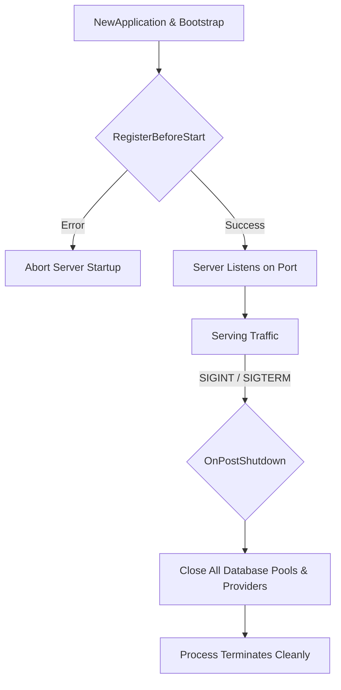

# Application Lifecycle & Bootstrap Documentation

The `bootstrap` package manages the initialization, middleware registration, lifecycle hooks, and server lifecycle of the application.

## Lifecycle Hooks Overview

Application hooks are configured in `bootstrap/hook.go` using the `core` contract instance (`*cores.AppContracts`).



---

## 1. Pre-Start Hooks (`RegisterBeforeStart`)

Pre-start hooks execute **before** the server opens the network socket listener (`app.Listen()`). If any pre-start hook returns an `error`, the startup process is aborted immediately, preventing traffic on an unready server.

In `fiber-starter`, `bootstrap/hook.go` uses `RegisterBeforeStart` to initialize database connections and connect repository contracts:

```go
core.RegisterBeforeStart(func() error {
    // 1. Database Connection & Contract Registration
    if cores.Config().Database.Enable {
        cores.SetDatabaseContract(func(pool *pgxpool.Pool) {
            // contract.DatabaseContract(pool) // Connects pgx pool to repository queries
        })
        if err := cores.ConnectDB(); err != nil {
            return fmt.Errorf("failed to connect to database: %w", err)
        }
    }

    // 2. Additional Pre-flight Initializations (e.g., Cache Warmup, External Providers)
    return nil
})
```

### Multi-Database Pre-flight Registration
For applications requiring secondary or named database connections (e.g., event logs or analytics):

```go
core.RegisterBeforeStart(func() error {
    if cores.Config().Database.Enable {
        // Named contract callback receives all named pools
        cores.SetNamedDatabaseContract(func(name string, pool *pgxpool.Pool) {
            if name == cores.DefaultDatabaseName {
                // contract.DatabaseContract(pool)
            }
        })

        // Connect default pool
        if err := cores.ConnectDB(); err != nil {
            return fmt.Errorf("failed to connect to default database: %w", err)
        }

        // Connect secondary named pool (example)
        // if _, err := cores.ConnectNamedDB("analytics", customConfig); err != nil {
        //     zap.L().Warn("Failed to connect analytics DB", zap.Error(err))
        // }
    }
    return nil
})
```

---

## 2. Teardown Hooks (`OnPostShutdown`)

Teardown hooks utilize Fiber v3's native lifecycle hooks (`app.Hooks().OnPostShutdown`) to gracefully close background connections and flush buffers when the server receives termination signals (`SIGINT`/`SIGTERM`).

```go
core.App.Hooks().OnPostShutdown(func(err error) error {
    if cores.Config().Database.Enable {
        cores.CloseDB() // Safely closes all active connection pools with panic recovery
        zap.L().Info("Database connection pool closed successfully")
    }
    return nil
})
```

---

## Execution Flow in `cmd/server/main.go`

The entrypoint initializes and runs the application via `bootstrap.NewApplication()`:

```go
func main() {
    bootstrap.NewApplication().
        Bootstrap().
        Run()
}
```

1. **`NewApplication()`**: Creates the core contract and initializes thread-safe Zap logger (`cores.NewLogger()`) and environment configs.
2. **`Bootstrap()`**: Creates the Fiber app, registers `bootstrap.RegisterHook`, attaches global middlewares (`Recover`, `Logger`, CORS, etc.), and maps routes.
3. **`Run()`**: Sets up OS signal traps (`SetupShutdownHook`), executes `RegisterBeforeStart` hooks, and starts listening on the configured port.
