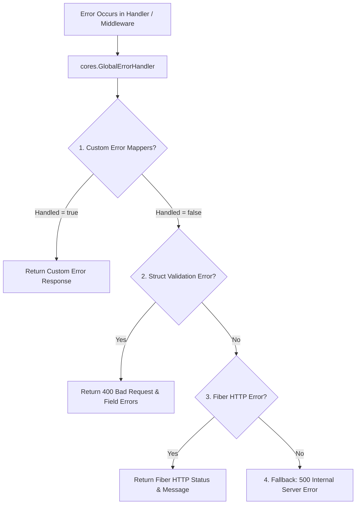

# Centralized & Extensible Error Handler

`fiber-starter` features a centralized, pluggable **Global Error Handler** built on top of **Fiber v3**. It provides consistent error responses across the application while remaining 100% extensible for custom domain errors.

---

## 🎯 Architecture Overview



---

## 🚀 How to Register Custom Error Mappers

Custom error mappers allow developers to capture domain errors (defined in `app/errors/*.go`) or third-party library errors without modifying `cores/` core framework code.

### 1. Define Custom Error Mapper (`app/errors/*.go`)

Create error types and mapper functions in your application package:

```go
package errors

import (
	"errors"

	"github.com/gofiber/fiber/v3"
)

type UserNotFoundError struct {
	UserID string
}

func (e *UserNotFoundError) Error() string {
	return "user with ID " + e.UserID + " not found"
}

// MapUserErrors converts domain user errors to HTTP responses
func MapUserErrors(c fiber.Ctx, err error) (int, any, bool) {
	var userNotFound *UserNotFoundError
	if errors.As(err, &userNotFound) {
		return fiber.StatusNotFound, fiber.Map{
			"code":    "USER_NOT_FOUND",
			"message": userNotFound.Error(),
		}, true // handled = true
	}

	return 0, nil, false // handled = false (fallback to core handlers)
}
```

---

### 2. Register Mappers in Bootstrap (`bootstrap/app.go`)

Use `RegisterErrorMapper` on `AppContracts`. It supports registering single or multiple mappers via variadic parameters:

```go
package bootstrap

import (
	"github.com/rachmanzz/fiber-starter/app/errors"
	"github.com/rachmanzz/fiber-starter/cores"
)

func InitErrorHandlers(app *cores.AppContracts) {
	// Register single or multiple mappers
	app.RegisterErrorMapper(
		errors.MapUserErrors,
		errors.MapAuthErrors,
		errors.MapDatabaseErrors,
	)
}
```

---

## ⚙️ Core Fallback Behaviors

If an error is not intercepted by any custom error mappers, `cores.GlobalErrorHandler` processes it through default fallback rules:

| Error Type | HTTP Status Code | Default Response Structure |
| :--- | :--- | :--- |
| **`validator.ValidationErrors`** | `400 Bad Request` | `{"success": false, "message": "Validation failed", "error": {"Field": "tag"}}` |
| **`*fiber.Error`** (e.g. 404, 405) | Error Status Code | `{"success": false, "message": "<Fiber Message>"}` |
| **Unhandled Error** | `500 Internal Server Error` | `{"success": false, "message": "Internal Server Error"}` (logged via Zap) |

---

## 🛠️ Overriding Global Handler via Config

If you need to replace the entire Global Error Handler implementation, supply your custom `ErrorHandler` in `fiber.Config` when calling `CreateApp`:

```go
appContract.CreateApp(fiber.Config{
    ErrorHandler: func(c fiber.Ctx, err error) error {
        return c.Status(500).SendString("Total custom error handler: " + err.Error())
    },
})
```
