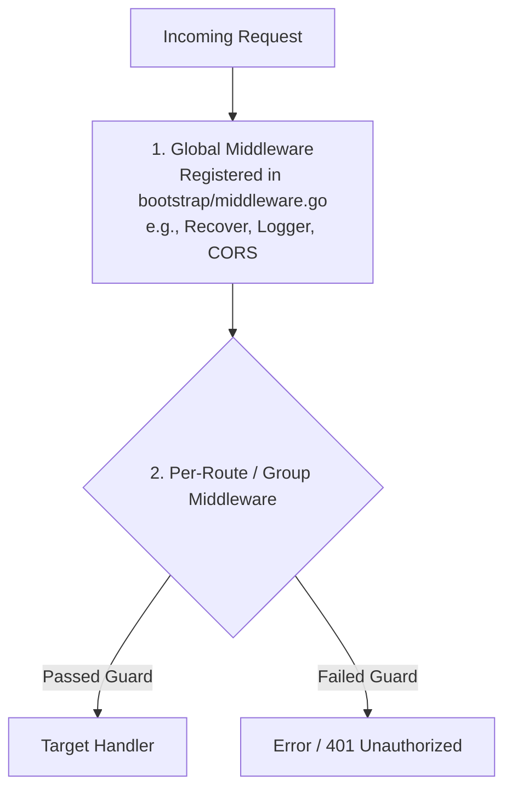

# Middleware & Goroutine Safety Guidelines

This document outlines middleware configuration and critical **Goroutine Safety Best Practices** when working with **Fiber v3**.

---

## 🎯 Middleware Types & Classification

In `fiber-starter`, middleware is classified into two distinct types based on scope:



### 1. Global Middleware
Global middleware applies to **every incoming HTTP request** across the application. It is registered in [`bootstrap/middleware.go`](../bootstrap/middleware.go):

```go
package bootstrap

import (
	"runtime/debug"

	"github.com/gofiber/fiber/v3"
	"github.com/gofiber/fiber/v3/middleware/recover"
	"go.uber.org/zap"
)

func RegisterMiddleware(app *fiber.App) {
	// Applies globally to all routes
	app.Use(recover.New(recover.Config{
		EnableStackTrace: true,
		StackTraceHandler: func(c fiber.Ctx, e any) {
			zap.L().Error("panic recovered",
				zap.Any("panic", e),
				zap.ByteString("stack", debug.Stack()),
			)
		},
		PanicHandler: func(c fiber.Ctx, r any) error {
			return fiber.NewError(fiber.StatusInternalServerError, "Internal Server Error")
		},
	}))
}
```

---

### 2. Per-Route & Route-Group Middleware (Guards)
Per-Route middleware (such as Auth Guards, Role Checks, Rate Limiters) applies **only to specific endpoints or route groups**. 

These custom guards are typically defined in `app/middleware/` or inline in `app/routes/` and attached directly to Fiber routes or route groups (`app.Group`):

#### **Example: Auth Guard Middleware (`app/middleware/auth.go`)**
```go
package middleware

import (
	"github.com/gofiber/fiber/v3"
	"github.com/rachmanzz/fiber-starter/cores"
)

func AuthGuard() fiber.Handler {
	return func(c fiber.Ctx) error {
		token := c.Get("Authorization")
		if token == "" {
			return cores.RespUnauthorized(c, "Authorization token is required")
		}
		// Validate token...
		return c.Next()
	}
}
```

#### **Applying Guards to Routes & Groups (`app/routes/api.go`)**
```go
package routes

import (
	"github.com/gofiber/fiber/v3"
	"github.com/rachmanzz/fiber-starter/app/middleware"
)

func ApiRoute(app *fiber.App) {
	api := app.Group("/api/v1")

	// Protected route group using AuthGuard middleware
	protected := api.Group("/user", middleware.AuthGuard())
	protected.Get("/profile", func(c fiber.Ctx) error {
		return c.SendString("Protected profile data")
	})
}
```

---

## ⚠️ Fiber v3 Goroutine Context Safety

In Fiber (which runs on `fasthttp`), **`fiber.Ctx` instances are pooled and reused across HTTP requests**.

> [!CAUTION]
> **NEVER pass the `fiber.Ctx` pointer directly into a background Goroutine!**
> Because `fiber.Ctx` is recycled once the HTTP handler returns, accessing `c` inside an async Goroutine leads to **data races, memory corruption, or dangling pointer bugs**.

---

### ❌ Incorrect / Unsafe Async Pattern

```go
// DO NOT DO THIS!
func AsyncHandler(c fiber.Ctx) error {
	go func() {
		// UNSAFE: c is recycled after AsyncHandler returns!
		userID := c.Params("id") 
		processBackgroundTask(userID)
	}()
	return c.SendString("Task started")
}
```

---

### ✅ Correct / Safe Async Pattern

#### 1. Extract Required Data Before Spawning Goroutine

Extract primitive values or copy data onto the stack before launching the Goroutine:

```go
func AsyncHandler(c fiber.Ctx) error {
	// Copy parameters/values needed by the background task
	userID := c.Params("id")

	go func(id string) {
		processBackgroundTask(id)
	}(userID)

	return c.SendString("Task started")
}
```

#### 2. Use Standard `context.Context` for Background Operations

When calling database repositories or external services asynchronously, use Go's standard `context.Background()` or `c.UserContext()` copied into context:

```go
func AsyncDatabaseTaskHandler(c fiber.Ctx) error {
	userID := c.Params("id")
	// Use standard context for async execution
	ctx := context.Background()

	go func(ctx context.Context, id string) {
		repo.UpdateUserStatusAsync(ctx, id)
	}(ctx, userID)

	return c.SendString("Processing")
}
```
